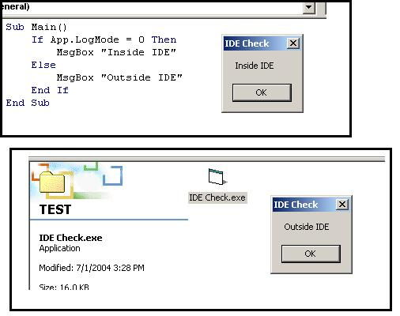

<div align="center">

## Check whether application is running from VB IDE or outside VB


</div>

### Description

<PRE><B>I was looking for a one line code which can tell me if i am running my application from inside ide or from outside vb scope because i need to call some api calls which crash my vb ide if i run them from inside vb. i had seen many working code for this but i think this checking is best... please vote and comment for this code.....</B></PRE>
 
### More Info
 


<span>             |<span>
---                |---
**Submitted On**   |
**By**             |[V2](https://github.com/Planet-Source-Code/PSCIndex/blob/master/ByAuthor/v2.md)
**Level**          |Beginner
**User Rating**    |4.9 (59 globes from 12 users)
**Compatibility**  |VB 5\.0, VB 6\.0
**Category**       |[Debugging and Error Handling](https://github.com/Planet-Source-Code/PSCIndex/blob/master/ByCategory/debugging-and-error-handling__1-26.md)
**World**          |[Visual Basic](https://github.com/Planet-Source-Code/PSCIndex/blob/master/ByWorld/visual-basic.md)
**Archive File**   |[](https://github.com/Planet-Source-Code/v2-check-whether-application-is-running-from-vb-ide-or-outside-vb__1-54688/archive/master.zip)


### Source Code

```
Sub Main()
 If App.LogMode = 0 Then
 MsgBox "Inside IDE"
 Else
 MsgBox "Outside IDE"
 End If
End Sub
```

